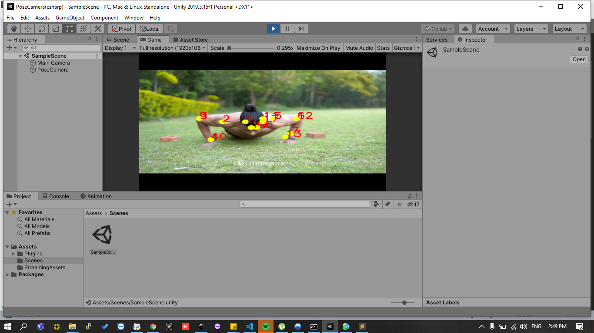

> This repository is still in development, dont use for any production use.

PoseCamera Unity SDK helps to build amazing games on Unity3d. PoseCamera provides simple and easy api to deteect human and its joints position so that you can control the game play using player body gestures.

Learn more about PoseCamera from this [link](https://wonder-tree.github.io/PoseCamera-Docs/)

## Get Started ?
Download the [source code](https://github.com/Wonder-Tree/PoseCamera-csharp) and run it on latest [Unity3D](https://unity.com/) version. You will find the *Sample* scene in scenes folder. 

